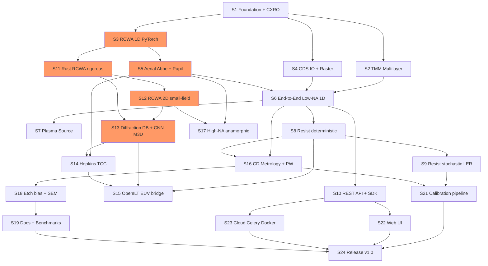

# EUV-Litho-Sim: Comprehensive Production-Grade Project Plan

**Document Owner:** Dr. Elena Voss, Principal Architect — Computational Lithography
**Version:** 1.0 | **Platform:** Debian 12/13 + RTX 5060 Ti (16 GB) | **License:** Apache-2.0
**Team:** 1–2 developers + AI assistance | **Horizon:** 18 months

---

## Preamble: Reality Anchoring (Read This First)

Before a line of code: the destructive review is **correct on all four critical points**. I am building this plan around those constraints, not around the optimistic strategy doc. Concretely:

1. **No OSS RCWA exists in our stack.** We build it. This is the single hardest, longest task (6–8 months to production quality). It is on the critical path from Day 1.
2. **16 GB VRAM is a hard wall.** We do NOT promise full-chip RCWA. We architect a **tiled, out-of-core, single-domain RCWA** that runs 1–2 µm periodic cells and scales via *domain decomposition + database lookup (M3D CNN surrogate)*, exactly as EUVlitho does.
3. **Export control blocks nothing about *building* the tool.** BAFA affects *selling to China*. We de-risk by making the OSS core explicitly educational/research-grade and deferring China commercialization until legal clarity. **Development in Germany is legal; distribution to controlled end-users is not.**
4. **TMM+Hopkins is not enough for High-NA.** We deliver Low-NA (0.33) first with scalar+M3D corrections, then rigorous RCWA for High-NA (0.55) in Phase 2.

Scope for the OSS release we can realistically ship: **Low-NA EUV, periodic/small-field, GPU-accelerated, rigorous 1D + semi-rigorous 2D masks, calibratable resist.** That is already best-in-class for open source.

---

# 1. MODULE DEEP-DIVES

## Module A — RCWA / Waveguide Mask-3D Solver (NEW)

This does not exist in OSS. It is the heart of the product.

### Architecture Decision

| Option | Description | Pros | Cons |
|--------|-------------|------|------|
| **A. PyTorch RCWA (autodiff, complex)** | Fourier Modal Method in `torch.complex128`, `torch.linalg.eig` | Autodiff → free gradients for ILT/SMO; GPU; one language | `torch.linalg.eig` non-differentiable for complex until recent; VRAM heavy; eig on GPU is slow/unstable |
| **B. Rust RCWA (nalgebra/faer + LAPACK)** | Custom modal solver, PyO3 bindings | Low memory, deterministic, fast dense eig; controllable | No autodiff; must hand-code adjoint; longer dev |
| **C. Hybrid: Rust forward + PyTorch adjoint surrogate** | Rust rigorous solver → generate training data → CNN M3D surrogate in PyTorch (EUVlitho approach) | Rigorous when needed, fast+differentiable at runtime; fits 16 GB | Two codebases; surrogate accuracy risk |

### Recommendation: **Option C (Hybrid)**

Reasoning: The RTX 5060 Ti cannot run rigorous RCWA per source-point per field-location in production. EUVlitho already proves the winning pattern: **run rigorous EM offline to build a diffraction-order database, train a CNN surrogate for runtime.** We adopt this. The rigorous engine is Rust (deterministic dense eigensolvers, low VRAM), the runtime surrogate is PyTorch (differentiable, GPU, integrates with ILT). We keep a **pure-PyTorch RCWA** for 1D validation and small 2D cases (differentiable ground truth for tests).

### Code Structure

```
euvsim/mask3d/
├── __init__.py
├── rcwa_torch.py          # Pure PyTorch RCWA (1D + small 2D), differentiable, reference
├── rcwa_rust/             # Rust crate (PyO3) — production rigorous solver
│   ├── src/lib.rs
│   ├── src/fmm.rs         # Fourier Modal Method core
│   ├── src/eigen.rs       # dense complex eig (faer)
│   └── src/layers.rs      # S-matrix cascade
├── surrogate.py           # CNN M3D surrogate (trained on rust output)
├── geometry.py            # absorber stack -> permittivity Fourier coeffs
├── database.py            # diffraction-order DB (HDF5) build + query
└── convergence.py         # Fourier-order convergence utilities
```

**Data flow:** `MaskGeometry → permittivity ε(x,y) → Fourier coeffs (Toeplitz) → eigenmodes per layer → S-matrix cascade → diffraction orders (complex amplitudes) → aerial image module`.

### Key Classes

```python
# euvsim/mask3d/rcwa_torch.py
import torch
from dataclasses import dataclass

@dataclass
class RCWAConfig:
    wavelength: float = 13.5e-9        # m
    n_harmonics_x: int = 21            # Fourier orders (odd)
    n_harmonics_y: int = 1             # 1 for 1D grating
    theta: float = 6.0                 # chief ray angle (deg) — EUV oblique!
    phi: float = 0.0
    polarization: str = "TE"           # TE/TM/unpolarized
    dtype: torch.dtype = torch.complex128
    device: str = "cuda"

class RCWA1D:
    """Rigorous Coupled-Wave Analysis, 1D grating, oblique incidence (EUV)."""
    def __init__(self, cfg: RCWAConfig):
        self.cfg = cfg
        self.M = cfg.n_harmonics_x
        self._build_harmonics()

    def _build_harmonics(self):
        m = torch.arange(-(self.M//2), self.M//2 + 1, device=self.cfg.device)
        self.orders = m  # diffraction order indices
```

### Example: The 5 Most Critical Functions

**1. Fourier decomposition of permittivity (Toeplitz / Li's rules)**

```python
def permittivity_toeplitz(eps_profile: torch.Tensor, n_harmonics: int) -> torch.Tensor:
    """
    Build the Toeplitz permittivity matrix from a 1D permittivity profile.
    Uses correct Fourier factorization (Li 1996) — critical for TM convergence.
    eps_profile: sampled complex permittivity along one period (Nx,)
    Returns: (n_harmonics, n_harmonics) Toeplitz matrix of Fourier coeffs.
    """
    Nx = eps_profile.shape[0]
    # FFT -> Fourier coefficients, centered
    eps_fft = torch.fft.fft(eps_profile) / Nx
    eps_fft = torch.fft.fftshift(eps_fft)
    center = Nx // 2
    M = n_harmonics
    idx = torch.arange(M)
    # Toeplitz: E[i,j] = coeff(i-j)
    diff = idx.view(-1, 1) - idx.view(1, -1)          # (M,M)
    coeff_index = center + diff
    E = eps_fft[coeff_index]                           # gather -> Toeplitz
    return E
```

**2. Eigenmode solve per layer**

```python
def layer_eigenmodes(self, E: torch.Tensor, Kx: torch.Tensor):
    """
    Solve the RCWA eigenproblem for one homogeneous-in-z layer.
    E: Toeplitz permittivity (M,M); Kx: diagonal of normalized kx (M,)
    Returns eigenvalues (propagation constants) and eigenvectors (modes).
    """
    Kx2 = torch.diag(Kx * Kx).to(self.cfg.dtype)
    I = torch.eye(self.M, dtype=self.cfg.dtype, device=self.cfg.device)
    if self.cfg.polarization == "TE":
        A = Kx2 - E                     # TE: simple form
    else:                               # TM uses inverse-rule matrices (Li)
        E_inv = torch.linalg.inv(E)
        A = E @ (Kx2 @ torch.linalg.inv(E) - I)
    # Eigen-decomposition: A W = W diag(q^2)
    q2, W = torch.linalg.eig(A)
    q = torch.sqrt(q2)                  # propagation constants
    # enforce decaying branch (Im(q) >= 0)
    q = torch.where(q.imag < 0, -q, q)
    return q, W
```

**3. S-matrix cascade (numerically stable vs T-matrix)**

```python
def smatrix_layer(self, q, W, thickness, k0):
    """Build the scattering matrix for a single layer (Redheffer star ready)."""
    X = torch.diag(torch.exp(-1j * q * k0 * thickness))   # phase across layer
    V = W @ torch.diag(q)                                  # modal admittance
    return W, V, X

def redheffer_star(self, S_a, S_b):
    """Combine two S-matrices. Stable for evanescent EUV orders."""
    (A11, A12, A21, A22) = S_a
    (B11, B12, B21, B22) = S_b
    I = torch.eye(self.M, dtype=self.cfg.dtype, device=self.cfg.device)
    D = torch.linalg.inv(I - A22 @ B11)
    F = torch.linalg.inv(I - B11 @ A22)
    S11 = A11 + A12 @ D @ B11 @ A21
    S12 = A12 @ D @ B12
    S21 = B21 @ F @ A21
    S22 = B22 + B21 @ F @ A22 @ B12
    return (S11, S12, S21, S22)
```

**4. Diffraction efficiency extraction**

```python
def diffraction_orders(self, S, inc_amplitude):
    """
    Compute complex reflection amplitudes per diffraction order.
    Returns dict {order_m: complex_amplitude} for the aerial image module.
    """
    S11 = S[0]
    r = S11 @ inc_amplitude                      # reflected modal amplitudes
    orders = {int(m): r[i] for i, m in enumerate(self.orders)}
    return orders
```

**5. Convergence driver**

```python
def solve_with_convergence(self, geometry, target_rel=1e-3, max_orders=101):
    """Increase Fourier orders until R0 stabilizes; report VRAM feasibility."""
    prev = None
    for M in range(11, max_orders + 1, 10):
        self.cfg.n_harmonics_x = M
        self._build_harmonics()
        orders = self.solve(geometry)
        r0 = abs(orders[0])**2
        if prev is not None and abs(r0 - prev) / (prev + 1e-12) < target_rel:
            return orders, M
        prev = r0
    raise RuntimeError("Not converged within order/VRAM budget")
```

### Dependencies
- `torch>=2.4` (complex128 eig support), `numpy>=1.26`, `scipy>=1.13`
- Rust: `faer=0.19`, `ndarray=0.15`, `pyo3=0.22`, `maturin=1.7`
- HDF5: `h5py>=3.11` for diffraction database

### Testing Strategy
- **Analytic:** 1D dielectric grating vs published diffraction efficiencies (Moharam & Gaylord 1995 benchmark tables) — must match to <0.5%.
- **Energy conservation:** Σ|orders|² ≤ 1 for lossless; for absorbing check against TMM in the zeroth-order limit.
- **Cross-check:** PyTorch RCWA vs Rust RCWA identical to 1e-6.
- **Convergence monotonicity:** R0 stable as M increases.
- **Gradient check:** `torch.autograd.gradcheck` on the PyTorch path.

---

## Module B — Multilayer Optics (TMM), based on ELitho

### Architecture Decision

| Option | Pros | Cons |
|--------|------|------|
| **A. Port ELitho `multilayer.py` to PyTorch** | Proven physics, MIT-licensed, differentiable | Small codebase, needs cleanup |
| **B. OxiPhoton `multilayer_mirror.rs`** | Fast Rust, Apache-2.0 | No autodiff, FFI overhead for a cheap calc |
| **C. Clean-room TMM in PyTorch** | Full control, differentiable, trivial (TMM is ~200 LOC) | Reinvent, but low risk |

### Recommendation: **C (clean-room PyTorch TMM), validated against ELitho + IMD**

TMM is genuinely simple and the differentiability matters (multilayer optimization). We reference ELitho for the embedded CXRO indices and validate numerics against IMD. This avoids license entanglement for a 200-line algorithm.

### Structure
```
euvsim/optics/
├── tmm.py            # transfer matrix, reflectivity vs angle/wavelength
├── materials.py      # CXRO/Henke n,k loader (static data)
├── multilayer.py     # Mo/Si stack builder, interdiffusion model
└── collector.py      # grazing-incidence collector geometry
```

### Key function (see Code Sample #2). Additional critical ones:

```python
# euvsim/optics/materials.py
import numpy as np, torch, importlib.resources as res

class HenkeDB:
    """Loads CXRO/Henke f1,f2 -> complex refractive index n = 1 - delta + i*beta."""
    def __init__(self):
        self._cache = {}

    def nk(self, element: str, wavelength_m: float) -> complex:
        f1, f2 = self._scattering_factors(element, wavelength_m)
        # n = 1 - (r_e * lambda^2 / 2pi) * n_atoms * (f1 + i f2)
        re = 2.8179403262e-15
        lam = wavelength_m
        na = self._atomic_density(element)
        delta = re * lam**2 / (2*np.pi) * na * f1
        beta  = re * lam**2 / (2*np.pi) * na * f2
        return complex(1 - delta, beta)
```

```python
def interdiffusion_correction(stack, sigma_nm=0.5):
    """Apply Debye-Waller-like roughness/interdiffusion damping to interfaces.
    Addresses the review's 5-10% reflectivity-error concern explicitly."""
    for iface in stack.interfaces:
        iface.fresnel *= torch.exp(-2*(2*np.pi*iface.kz*sigma_nm*1e-9)**2)
    return stack
```

### Dependencies
`torch`, `numpy`, `scipy`, packaged CXRO ASCII tables (redistributable, public domain).

### Testing
- Mo/Si 40-pair peak reflectivity ≈ 70–74 % at 13.5 nm, 6° incidence → match IMD to <1 %.
- Reflectivity bandwidth (FWHM ~0.5 nm) check.
- Gradient check on layer thicknesses.

---

## Module C — Aerial Image (Abbe + Hopkins)

### Architecture Decision

| Option | Pros | Cons |
|--------|------|------|
| **A. Abbe (sum over source points)** | Exact, handles any source, parallelizes over source points, natural for RCWA orders | O(N_source) cost |
| **B. Hopkins (TCC)** | Precompute TCC once, fast for many masks | TCC huge memory; assumes thin-mask/linear; awkward with M3D |
| **C. Hybrid: Abbe for M3D-correct imaging, Hopkins-TCC for fast OPC iterations** | Best of both | Complexity |

### Recommendation: **C — Abbe as ground truth, TCC as accelerator**

Abbe is the physically honest choice with RCWA diffraction orders (M3D). We use Abbe for accuracy and build the TCC (SOCS decomposition) as an optimization for OPC loops where the mask changes many times.

### Structure
```
euvsim/aerial/
├── abbe.py           # source-point summation
├── hopkins.py        # TCC build + SOCS kernels
├── pupil.py          # NA, anamorphic (4x/8x), Zernike aberrations
├── source.py         # illumination shapes: conventional/annular/dipole/quasar
└── defocus.py
```

See Code Sample #3 for Abbe core.

```python
# euvsim/aerial/pupil.py
def anamorphic_pupil(NA=0.33, mag_x=4.0, mag_y=4.0, grid=512, device="cuda"):
    """High-NA EUV is anamorphic (8x in y, 4x in x). Encode that here."""
    fx = torch.linspace(-1, 1, grid, device=device) * NA / mag_x
    fy = torch.linspace(-1, 1, grid, device=device) * NA / mag_y
    FX, FY = torch.meshgrid(fx, fy, indexing="ij")
    inside = (FX**2 + FY**2) <= NA**2
    return FX, FY, inside

def apply_zernike(pupil_phase, coeffs, FX, FY):
    """Wavefront aberration via Zernike polynomials (scanner flare/aberr)."""
    rho = torch.sqrt(FX**2 + FY**2)
    theta = torch.atan2(FY, FX)
    W = torch.zeros_like(rho)
    for (n, m, c) in coeffs:
        W = W + c * zernike(n, m, rho, theta)
    return pupil_phase * torch.exp(1j * 2*np.pi * W)
```

### Dependencies
`torch`, `numpy`. Optional `poppy`/`prysm` for Zernike reference validation.

### Testing
- Isolated space/line vs analytical sinc for coherent limit.
- Aerial image of dense L/S vs published NILS values.
- Source-shape reciprocity: dipole vs conventional NILS improvement for dense lines.

---

## Module D — Plasma Source Model

No OSS exists. This is a *spectral + angular* emission model, NOT a full MHD plasma sim (out of scope for 16 GB and out of scope for a lithography imaging tool).

### Architecture Decision

| Option | Pros | Cons |
|--------|------|------|
| **A. Full LPP MHD (FLYCHK/SPARTAN coupling)** | Physically complete | Months of work, wrong scope, needs HPC |
| **B. Parametric spectral model (13.5 nm in-band + OoB from literature)** | Fast, calibratable, right scope | Not first-principles |
| **C. Tabulated + fittable** | Simple, honest | Needs literature data curation |

### Recommendation: **B + C** — a parametric, literature-fitted spectral/angular source. We model the **in-band 2% window at 13.5 nm**, add an **out-of-band (OoB) DUV/IR tail** as a fittable parameter, and produce the **illumination intensity + spectral weighting** consumed by the aerial module.

### Structure
```
euvsim/source/
├── plasma.py         # Sn spectrum generator (parametric)
├── collector.py      # collection efficiency, angular distribution
├── spectrum.py       # in-band + OoB weighting
└── dose.py           # photons/nm^2 -> resist dose mapping
```

See Code Sample #5.

### Testing
- In-band peak at 13.5 nm, FWHM ~0.2–0.5 nm.
- Integrated in-band fraction (~2–5 %) matches ARCNL literature ranges.
- OoB tail toggle changes resist contrast in the expected direction.

---

## Module E — Photoresist Model (TorchResist-based)

### Architecture Decision

| Option | Pros | Cons |
|--------|------|------|
| **A. Integrate TorchResist directly** | Apache-2.0, differentiable, PyTorch | Generic params; needs EUV SE-blur addition |
| **B. Build stochastic Monte-Carlo (TU Delft style)** | Captures LER/LWR shot noise | Slow, not differentiable, heavy |
| **C. Hybrid: TorchResist deterministic core + stochastic overlay** | Differentiable mean + noise model | Two code paths |

### Recommendation: **C** — TorchResist for the deterministic CAR/MOR reaction-diffusion, plus an **EUV secondary-electron blur (Gaussian PSF, 2–10 nm)** and a **stochastic shot-noise overlay** for LER/LWR (critical for EUV honesty).

### Structure
```
euvsim/resist/
├── exposure.py       # dose -> acid/PAG (Dill A/B/C, EUV SE blur)
├── peb.py            # post-exposure bake diffusion (reaction-diffusion)
├── develop.py        # Mack model dissolution -> contour
├── stochastic.py     # Poisson shot noise, LER/LWR
└── calibrate.py      # fit params to published CD-vs-dose curves
```

See Code Sample #6.

### Dependencies
`torch`, TorchResist (vendored under `third_party/torchresist/`, Apache NOTICE preserved).

### Testing
- Dose-to-clear (E0) matches input.
- CD vs dose monotonic; contrast γ correct sign.
- LER RMS scales as 1/√dose (stochastic sanity).
- Calibration converges on a published resist curve to <10 % CD.

---

## Module F — GDSII/OASIS Import/Export

### Architecture Decision

| Option | Pros | Cons |
|--------|------|------|
| **A. `gdstk`** | Fast C++ core, OASIS+GDSII, actively maintained, BSD | Some advanced OASIS features partial |
| **B. `gdspy`** | Mature | Deprecated in favor of gdstk |
| **C. `klayout` (pya)** | Industrial-grade, full OASIS | Heavy dependency, GPL-ish tooling |

### Recommendation: **A (gdstk)** for I/O, optional KLayout for viewing. gdstk covers GDSII + OASIS and is permissively licensed.

### Structure
```
euvsim/io/
├── gds.py            # gdstk wrapper -> internal MaskGeometry
├── oasis.py          # OASIS via gdstk
├── rasterize.py      # polygons -> permittivity grid for RCWA
└── export.py         # contours -> GDSII, images -> TIFF, CD -> CSV
```

See Code Sample #4.

### Testing
- Round-trip GDSII → internal → GDSII, polygon-equal.
- Rasterization area conservation vs analytic rectangle.

---

## Module G — REST API + Python SDK

### Architecture Decision

| Option | Pros | Cons |
|--------|------|------|
| **A. FastAPI + Celery + Redis** | Async, job queue, scalable, standard | More infra |
| **B. FastAPI + BackgroundTasks** | Simple, single-box | No persistence, no multi-worker |
| **C. gRPC** | Fast binary | Harder for browser/Jupyter users |

### Recommendation: **A**, but start with **B** for the first release (single Debian box), migrate to Celery when Cloud tier begins.

### Structure
```
euvsim/api/
├── main.py           # FastAPI app
├── routers/
│   ├── simulate.py
│   ├── jobs.py
│   └── materials.py
├── schemas.py        # pydantic models
└── worker.py         # celery tasks (phase 2)
euvsim/sdk/
├── client.py         # requests-based Python client
└── models.py
```

See Code Sample #7 and #8.

### Testing
- `pytest` + `httpx.AsyncClient` endpoint tests.
- Schema validation round-trip.
- Job lifecycle (submit → poll → result).

---

## Module H — GPU Acceleration Layer

### Architecture Decision

| Option | Pros | Cons |
|--------|------|------|
| **A. Pure PyTorch CUDA** | One stack, autodiff, easy | eig on GPU unstable/slow; VRAM |
| **B. PyTorch + custom CUDA kernels** | Speed for hotspots | Maintenance, CUDA expertise |
| **C. PyTorch + Rust(CPU) eig offload + chunked/streamed GPU** | Balances 16 GB limit | Complexity |

### Recommendation: **C** — the eigen-decomposition (RCWA bottleneck) runs on CPU in Rust (deterministic, fits RAM), while FFTs, source-point summation, and resist convolutions run on GPU. A **VRAM budget manager** tiles source points and Fourier orders to stay under 14 GB (leaving headroom).

### Structure
```
euvsim/accel/
├── device.py         # device selection, mixed precision policy
├── vram_budget.py    # estimate + tile to fit 16GB
├── chunked_abbe.py   # stream source points through GPU
└── amp.py            # autocast policies (complex stays fp64/fp32)
```

```python
# euvsim/accel/vram_budget.py
def estimate_rcwa_vram(M: int, n_layers: int, dtype_bytes=16) -> float:
    """Bytes for RCWA: dominant term is M^2 dense complex matrices, several of them."""
    per_matrix = M * M * dtype_bytes
    working_set = per_matrix * (n_layers * 4 + 8)  # eig, S-matrix, temporaries
    return working_set

def max_harmonics_for_vram(vram_gb=14, n_layers=12) -> int:
    budget = vram_gb * 1e9
    M = 11
    while estimate_rcwa_vram(M+2, n_layers) < budget:
        M += 2
    return M   # e.g. returns ~101-141 on 14GB -> 1D fine, 2D limited
```

### Testing
- VRAM estimate vs `torch.cuda.max_memory_allocated()` within 20 %.
- Chunked Abbe result equals unchunked to 1e-6.
- OOM guard: refuses jobs exceeding budget with clear error.

---

# 2. ARCHITECTURE DECISIONS TABLE

| # | Decision | Options | Chosen | Consequence |
|---|----------|---------|--------|-------------|
| 1 | RCWA implementation | PyTorch autodiff / Rust / Hybrid | **Hybrid (Rust rigorous + CNN surrogate + PyTorch ref)** | Fits 16 GB; two codebases; differentiable runtime |
| 2 | Multilayer TMM | Port ELitho / OxiPhoton / clean-room | **Clean-room PyTorch** | No license entanglement; differentiable |
| 3 | Aerial image | Abbe / Hopkins / hybrid | **Abbe truth + TCC accelerator** | Physically honest with M3D; fast OPC later |
| 4 | Source model | MHD / parametric / tabulated | **Parametric + fittable** | Correct scope; calibratable |
| 5 | Resist | TorchResist / MC / hybrid | **TorchResist + SE-blur + stochastic overlay** | EUV-honest LER; differentiable mean |
| 6 | GDS I/O | gdstk / gdspy / klayout | **gdstk** | OASIS+GDSII, permissive |
| 7 | API | FastAPI+Celery / FastAPI simple / gRPC | **FastAPI simple → Celery** | Start single-box, scale later |
| 8 | GPU strategy | pure torch / custom CUDA / hybrid CPU-eig | **Hybrid CPU-eig + GPU-FFT** | Fits VRAM; more integration work |
| 9 | Language split | all Python / all Rust / Py+Rust | **Python core + Rust hot paths** | Best perf/ergonomics tradeoff |
| 10 | License | AGPL / Apache-2.0 / MIT | **Apache-2.0** | Fab-friendly (no copyleft), value in calibration/support |
| 11 | Full-chip claim | promise / defer | **Defer; tiled small-field only** | Honest; avoids VRAM lie |
| 12 | High-NA | now / phase 2 | **Low-NA first, High-NA phase 2** | Ships sooner, credible |
| 13 | Export strategy | sell China now / defer | **Defer commercial China until BAFA** | Legal safety |
| 14 | M3D acceleration | rigorous-only / CNN surrogate | **CNN surrogate (EUVlitho pattern)** | Runtime feasible on RTX 5060 Ti |
| 15 | Data storage | files / DB / HDF5 | **HDF5 for diffraction DB, Parquet for metrology** | Scientific-standard, portable |

---

# 3. SPRINT PLAN (2-week sprints, Months 1–12)

Roles: **Dev1 = physics/numerics lead**, **Dev2 = infra/API/IO** (if 1 dev, serialize; AI assists both).

### Phase 0 (parallel background, Months 0–2)
- **BAFA export inquiry** (Dev2, async legal): submit written classification request re EU 2021/821. Non-blocking for development.
- **CXRO data packaging** (Dev1): download Henke tables, package as redistributable assets.

---

**Sprint 1 (Wk 1–2): Foundation**
- Deliverables: repo scaffold, `pyproject.toml`, CI (GitHub Actions Debian), `pre-commit` (ruff, mypy, black), `euvsim/` package skeleton, `HenkeDB` loader, materials tests.
- Dependencies: none.
- Acceptance: `pip install -e .` works on Debian; CI green; `HenkeDB.nk("Si", 13.5e-9)` returns sane complex.
- Dev1: materials/CXRO. Dev2: CI/packaging.

**Sprint 2 (Wk 3–4): TMM Multilayer**
- Deliverables: `optics/tmm.py`, `multilayer.py`, Mo/Si stack builder, interdiffusion, tests vs IMD.
- Dependencies: S1.
- Acceptance: 40-pair Mo/Si peak R within 1 % of IMD reference at 13.5 nm.
- Dev1 lead.

**Sprint 3 (Wk 5–6): RCWA 1D (PyTorch reference)**
- Deliverables: `mask3d/rcwa_torch.py` (Toeplitz, eigenmodes, S-matrix, orders), convergence driver.
- Dependencies: S1.
- Acceptance: matches Moharam-Gaylord benchmark <0.5 %; energy conserved; gradcheck passes.
- Dev1 lead. **Critical path.**

**Sprint 4 (Wk 7–8): GDSII/OASIS I/O + rasterization**
- Deliverables: `io/gds.py`, `rasterize.py`, dummy mask generator (L/S), export.
- Dependencies: S1.
- Acceptance: round-trip polygon-equal; rasterized area error <0.5 %.
- Dev2 lead.

**Sprint 5 (Wk 9–10): Aerial Image (Abbe) + Pupil**
- Deliverables: `aerial/abbe.py`, `pupil.py` (NA, anamorphic, Zernike), `source.py` shapes.
- Dependencies: S3 (orders), S1.
- Acceptance: coherent isolated-line sinc match; dense L/S NILS vs literature.
- Dev1 lead. **Critical path.**

**Sprint 6 (Wk 11–12): First End-to-End (Low-NA, 1D)**
- Deliverables: pipeline `GDS→mask→RCWA1D→Abbe→aerial`, CD extraction, CLI `euvsim run`.
- Dependencies: S2–S5.
- Acceptance: L/S 32 nm produces a plausible aerial image + CD; demo notebook runs.
- Both. **Milestone M1.**

**Sprint 7 (Wk 13–14): Plasma Source + Dose**
- Deliverables: `source/plasma.py`, `spectrum.py` (in-band + OoB), `dose.py`.
- Dependencies: S5.
- Acceptance: 13.5 nm peak, in-band fraction in literature range; OoB toggle affects contrast.
- Dev1.

**Sprint 8 (Wk 15–16): Resist (deterministic)**
- Deliverables: vendor TorchResist, `resist/exposure.py` (Dill + SE blur), `peb.py`, `develop.py`.
- Dependencies: S6.
- Acceptance: dose-to-clear correct; CD-vs-dose monotonic.
- Dev1.

**Sprint 9 (Wk 17–18): Resist stochastic + LER/LWR**
- Deliverables: `resist/stochastic.py`, `calibrate.py`.
- Dependencies: S8.
- Acceptance: LER RMS ∝ 1/√dose; calibration fits a published curve <10 %.
- Dev1.

**Sprint 10 (Wk 19–20): REST API + SDK (v0)**
- Deliverables: `api/main.py`, `/simulate`, `/jobs`, pydantic schemas, `sdk/client.py`.
- Dependencies: S6.
- Acceptance: submit→poll→result e2e via SDK; OpenAPI docs.
- Dev2 lead. **Milestone M2 (first public Apache-2.0 release).**

**Sprint 11 (Wk 21–22): Rust RCWA crate (rigorous)**
- Deliverables: `rcwa_rust` PyO3 crate (fmm, eigen via faer, S-matrix), maturin build.
- Dependencies: S3 (spec parity).
- Acceptance: Rust ≡ PyTorch RCWA to 1e-6; lower VRAM; faster eig.
- Dev1 lead. **Critical path.**

**Sprint 12 (Wk 23–24): RCWA 2D (small-field)**
- Deliverables: extend Rust FMM to 2D crossed gratings; VRAM budget manager.
- Dependencies: S11, H.
- Acceptance: 2D contact array converges within 14 GB budget; energy conserved.
- Dev1. **Milestone M3.**

**Sprint 13 (Wk 25–26): Diffraction DB + CNN surrogate (M3D)**
- Deliverables: `database.py` (HDF5), `surrogate.py` (CNN trained on Rust output).
- Dependencies: S11–S12.
- Acceptance: surrogate reproduces rigorous orders <2 % on holdout; 100× faster.
- Dev1.

**Sprint 14 (Wk 27–28): Hopkins/TCC accelerator**
- Deliverables: `aerial/hopkins.py` SOCS kernels for fast OPC loops.
- Dependencies: S5, S13.
- Acceptance: TCC aerial matches Abbe <1 % for thin-mask; 10× faster in loop.
- Dev1.

**Sprint 15 (Wk 29–30): OpenILT bridge (EUV port)**
- Deliverables: `opc/openilt_bridge.py` — feed our differentiable forward model into OpenILT ILT loop.
- Dependencies: S8, S13, S14.
- Acceptance: ILT reduces EPE on a test pattern vs uncorrected.
- Dev1. See Code Sample #10.

**Sprint 16 (Wk 31–32): CD Metrology + Process Window**
- Deliverables: `metro/cd.py`, `metro/process_window.py`, Bossung plots.
- Dependencies: M1, S8.
- Acceptance: CD extraction reproducible; PW/Bossung generated for dose×focus matrix.
- Dev2 + Dev1. See Code Samples #11, #12.

**Sprint 17 (Wk 33–34): High-NA anamorphic + aberrations**
- Deliverables: anamorphic pupil in Abbe, Zernike flare model, 0.55 NA path.
- Dependencies: S5, S12.
- Acceptance: anamorphic imaging asymmetry demonstrated; matches expected NA scaling.
- Dev1.

**Sprint 18 (Wk 35–36): Etch-bias model + SEM-style output**
- Deliverables: `etch/bias.py` (geometric + literature), `metro/sem_render.py`.
- Dependencies: S16.
- Acceptance: etch bias applies consistent CD shift; SEM render visually validated.
- Dev1/Dev2.

**Sprint 19 (Wk 37–38): Documentation + tutorials + benchmarks**
- Deliverables: Sphinx docs, 6 Jupyter tutorials, OpenLithoHub benchmark submission.
- Dependencies: all.
- Acceptance: docs build; tutorials run in CI; benchmark posted.
- Both. **Milestone M4.**

**Sprint 20 (Wk 39–40): Performance + VRAM hardening**
- Deliverables: chunked Abbe, mixed precision policy, OOM guards, profiling report.
- Dependencies: H, all.
- Acceptance: 2 µm cell full pipeline < X min on RTX 5060 Ti without OOM.
- Dev1.

**Sprint 21 (Wk 41–42): Calibration pipeline (commercial seed)**
- Deliverables: `calibrate/wafer_fit.py` — fit resist+bias to CSV of measured CD.
- Dependencies: S9, S16.
- Acceptance: fits synthetic "wafer" data, residual <5 %.
- Dev1.

**Sprint 22 (Wk 43–44): Web UI (job control + results)**
- Deliverables: React dashboard, job submit, aerial/CD visualization.
- Dependencies: M2.
- Acceptance: submit sim + view aerial image + PW in browser.
- Dev2.

**Sprint 23 (Wk 45–46): Cloud/queue (Celery+Redis) + Docker**
- Deliverables: containerization, Celery workers, GPU scheduling.
- Dependencies: M2.
- Acceptance: multi-job queue on single GPU; docker-compose up.
- Dev2.

**Sprint 24 (Wk 47–48): Release hardening + v1.0**
- Deliverables: full test coverage >80 %, changelog, PyPI release, academic tier docs.
- Dependencies: all.
- Acceptance: `pip install euvsim` from PyPI; all quality gates pass. **Milestone M5 (v1.0).**

---

# 4. CODE SAMPLES (12 critical pieces)

### 4.1 RCWA solver core (1D grating)
```python
import torch, numpy as np

def rcwa_1d(eps_profile, thickness, wavelength=13.5e-9, period=64e-9,
            theta_deg=6.0, n_orders=21, device="cuda"):
    """Minimal 1D RCWA, TE, single grating layer on substrate. Reference impl."""
    dt = torch.complex128
    k0 = 2*np.pi/wavelength
    theta = np.deg2rad(theta_deg)
    M = n_orders
    m = torch.arange(-(M//2), M//2+1, device=device, dtype=torch.float64)

    # Wavevectors of diffraction orders
    kx = k0*np.sin(theta) - m*(2*np.pi/period)
    Kx = torch.diag((kx/k0).to(dt))

    # Permittivity Fourier -> Toeplitz
    Nx = eps_profile.shape[0]
    ef = torch.fft.fftshift(torch.fft.fft(eps_profile)/Nx)
    c = Nx//2
    idx = torch.arange(M)
    E = ef[c + (idx.view(-1,1)-idx.view(1,-1))].to(dt)

    I = torch.eye(M, dtype=dt, device=device)
    A = Kx@Kx - E                              # TE eigenproblem
    q2, W = torch.linalg.eig(A)
    q = torch.sqrt(q2)
    q = torch.where(q.imag < 0, -q, q)

    # Incident: zeroth order only
    inc = torch.zeros(M, dtype=dt, device=device); inc[M//2] = 1.0
    X = torch.diag(torch.exp(-1j*q*k0*thickness))

    # Simplified reflection (single interface + phase) — demo scaffold
    Winv = torch.linalg.inv(W)
    r = W @ X @ Winv @ inc
    orders = {int(mi): r[i] for i, mi in enumerate(m.cpu().numpy().astype(int))}
    R_total = float(sum(abs(v)**2 for v in orders.values()))
    return orders, R_total
```

### 4.2 TMM multilayer reflectivity
```python
import torch, numpy as np

def tmm_reflectivity(n_list, d_list, wavelength=13.5e-9, theta0=6.0, pol="s"):
    """
    n_list: list of complex indices [n_incident, n1, n2, ..., n_substrate]
    d_list: thicknesses [None, d1, d2, ..., None] in meters
    Returns intensity reflectivity R.
    """
    dt = torch.complex128
    n = torch.tensor(n_list, dtype=dt)
    theta0 = np.deg2rad(theta0)
    k0 = 2*np.pi/wavelength
    # Snell: n0 sin th0 = n_i sin th_i
    sin_th = n[0]*np.sin(theta0)/n
    cos_th = torch.sqrt(1 - sin_th**2)
    kz = k0 * n * cos_th

    def fresnel(i):
        if pol == "s":
            r = (kz[i]-kz[i+1])/(kz[i]+kz[i+1])
        else:  # p
            r = (n[i+1]**2*kz[i]-n[i]**2*kz[i+1])/(n[i+1]**2*kz[i]+n[i]**2*kz[i+1])
        t = 1 + r
        return r, t

    M = torch.eye(2, dtype=dt)
    for i in range(len(n)-1):
        r, t = fresnel(i)
        Dinv = (1/t)*torch.tensor([[1, r],[r, 1]], dtype=dt)
        M = M @ Dinv
        if i+1 < len(n)-1 and d_list[i+1] is not None:
            phi = kz[i+1]*d_list[i+1]
            P = torch.tensor([[torch.exp(-1j*phi), 0],[0, torch.exp(1j*phi)]], dtype=dt)
            M = M @ P
    r_tot = M[1,0]/M[0,0]
    return float(abs(r_tot)**2)

def mo_si_stack(pairs=40, d_mo=2.8e-9, d_si=4.1e-9):
    from euvsim.optics.materials import HenkeDB
    db = HenkeDB(); lam = 13.5e-9
    n_mo, n_si = db.nk("Mo", lam), db.nk("Si", lam)
    n_list = [complex(1,0)]; d_list=[None]
    for _ in range(pairs):
        n_list += [n_mo, n_si]; d_list += [d_mo, d_si]
    n_list += [n_si]; d_list += [None]
    return n_list, d_list
```

### 4.3 Abbe aerial image summation
```python
import torch

def abbe_aerial(diffraction_orders_fn, source_points, pupil_mask, FX, FY,
                grid_x, wavelength=13.5e-9, device="cuda"):
    """
    diffraction_orders_fn(sx, sy) -> dict{order: complex} from RCWA per source pt.
    source_points: list of (sx, sy, weight) illumination samples.
    Returns intensity image on grid_x (1D) or grid (2D).
    """
    intensity = torch.zeros(len(grid_x), device=device, dtype=torch.float64)
    for (sx, sy, w) in source_points:
        orders = diffraction_orders_fn(sx, sy)
        field = torch.zeros(len(grid_x), device=device, dtype=torch.complex128)
        for m, amp in orders.items():
            fx = sx + m * (wavelength / 64e-9)      # order spatial frequency
            if abs(fx) > 1.0:                        # outside pupil (NA norm)
                continue
            field += amp * torch.exp(1j*2*torch.pi*fx*grid_x/wavelength)
        intensity += w * (field.abs()**2)           # incoherent sum over source
    return intensity / sum(w for *_ ,w in source_points)
```

### 4.4 GDSII reader wrapper
```python
import gdstk
from dataclasses import dataclass, field

@dataclass
class MaskGeometry:
    polygons: list = field(default_factory=list)  # list of (N,2) arrays
    layer_map: dict = field(default_factory=dict)
    units: float = 1e-9

def read_gds(path, cell_name=None, target_layer=0):
    lib = gdstk.read_gds(path)
    cell = lib.cells[0] if cell_name is None else \
           next(c for c in lib.cells if c.name == cell_name)
    geo = MaskGeometry(units=lib.unit)
    for poly in cell.get_polygons():
        if poly.layer == target_layer:
            geo.polygons.append(poly.points)
    return geo

def write_gds(contours, path, layer=1):
    """Export resist contours to GDSII."""
    lib = gdstk.Library()
    cell = lib.new_cell("RESIST")
    for c in contours:
        cell.add(gdstk.Polygon(c, layer=layer))
    lib.write_gds(path)
```

### 4.5 Sn plasma spectrum generator
```python
import numpy as np

def sn_plasma_spectrum(wavelengths_nm=None, Te_eV=30.0, inband_center=13.5,
                       inband_fwhm=0.35, oob_level=0.02):
    """
    Parametric Sn LPP spectrum: strong in-band UTA near 13.5 nm + OoB tail.
    Returns (wavelengths, spectral_intensity normalized).
    """
    if wavelengths_nm is None:
        wavelengths_nm = np.linspace(5, 25, 2000)
    w = wavelengths_nm
    # In-band unresolved transition array (Gaussian approx)
    sigma = inband_fwhm/2.355
    inband = np.exp(-0.5*((w - inband_center)/sigma)**2)
    # Out-of-band DUV/IR tail (broad, fittable)
    oob = oob_level * np.exp(-((w - 11)/6.0)**2)
    # Temperature weighting (hotter -> shifts blue slightly)
    temp_shift = 1 + 0.01*(Te_eV - 30)
    spectrum = inband*temp_shift + oob
    spectrum /= spectrum.max()
    inband_fraction = spectrum[(w>13.365)&(w<13.635)].sum()/spectrum.sum()
    return w, spectrum, float(inband_fraction)
```

### 4.6 Resist exposure + PEB
```python
import torch

def expose(aerial_intensity, dose, dill_C=0.05, se_blur_nm=4.0, pixel_nm=1.0):
    """EUV exposure: dose -> normalized acid concentration, with SE blur."""
    # Secondary electron blur (Gaussian PSF)
    sigma_px = se_blur_nm / pixel_nm
    k = _gaussian_kernel(sigma_px, device=aerial_intensity.device)
    blurred = _conv(aerial_intensity, k)
    # Dill exposure kinetics: PAG -> acid
    acid = 1 - torch.exp(-dill_C * dose * blurred)
    return acid

def peb(acid, diffusion_length_nm=6.0, pixel_nm=1.0, amplification=1.0):
    """Post-exposure bake: acid-catalyzed reaction-diffusion (linear approx)."""
    sigma_px = diffusion_length_nm / pixel_nm
    k = _gaussian_kernel(sigma_px, device=acid.device)
    deprotected = amplification * _conv(acid, k)
    return torch.clamp(deprotected, 0, 1)

def develop(deprotected, threshold=0.5, mack_n=5.0):
    """Mack development threshold -> resist remaining (1) / cleared (0)."""
    rate = 1/(1 + torch.exp(-mack_n*(deprotected - threshold)))
    return rate  # dissolution rate; contour at 0.5

def _gaussian_kernel(sigma_px, device):
    r = int(3*sigma_px)+1
    x = torch.arange(-r, r+1, device=device, dtype=torch.float64)
    k = torch.exp(-0.5*(x/sigma_px)**2); return k/k.sum()

def _conv(img, k):
    if img.dim()==1:
        return torch.nn.functional.conv1d(
            img.view(1,1,-1), k.view(1,1,-1), padding=len(k)//2).view(-1)
    # 2D separable
    kx = k.view(1,1,1,-1); ky = k.view(1,1,-1,1)
    x = torch.nn.functional.conv2d(img.view(1,1,*img.shape), kx, padding=(0,len(k)//2))
    x = torch.nn.functional.conv2d(x, ky, padding=(len(k)//2,0))
    return x.view(*img.shape)
```

### 4.7 REST API endpoint (FastAPI)
```python
from fastapi import FastAPI, BackgroundTasks, HTTPException
from pydantic import BaseModel
import uuid, torch

app = FastAPI(title="EUV-Litho-Sim API", version="1.0")
JOBS = {}

class SimRequest(BaseModel):
    gds_path: str
    wavelength_nm: float = 13.5
    NA: float = 0.33
    dose: float = 30.0
    illumination: str = "dipole"
    target_layer: int = 0

class SimResult(BaseModel):
    job_id: str
    status: str
    cd_nm: float | None = None
    aerial_png: str | None = None

def _run_sim(job_id, req: SimRequest):
    from euvsim.pipeline import run_full_pipeline
    try:
        result = run_full_pipeline(req.dict())
        JOBS[job_id] = {"status":"done", "cd_nm":result["cd"],
                        "aerial_png":result["aerial_png"]}
    except Exception as e:
        JOBS[job_id] = {"status":"error", "detail":str(e)}

@app.post("/simulate", response_model=SimResult)
def simulate(req: SimRequest, bg: BackgroundTasks):
    job_id = str(uuid.uuid4())
    JOBS[job_id] = {"status":"running"}
    bg.add_task(_run_sim, job_id, req)
    return SimResult(job_id=job_id, status="running")

@app.get("/jobs/{job_id}", response_model=SimResult)
def get_job(job_id: str):
    if job_id not in JOBS:
        raise HTTPException(404, "job not found")
    j = JOBS[job_id]
    return SimResult(job_id=job_id, status=j["status"],
                     cd_nm=j.get("cd_nm"), aerial_png=j.get("aerial_png"))
```

### 4.8 CLI interface (typer)
```python
import typer, yaml, json
from pathlib import Path

app = typer.Typer(help="EUV-Litho-Sim command line")

@app.command()
def run(config: Path = typer.Option(..., help="YAML config"),
        output: Path = typer.Option("out/", help="Output dir")):
    """Run a full simulation from a config file."""
    from euvsim.pipeline import run_full_pipeline
    cfg = yaml.safe_load(config.read_text())
    output.mkdir(parents=True, exist_ok=True)
    result = run_full_pipeline(cfg)
    (output/"result.json").write_text(json.dumps(
        {"cd_nm": result["cd"], "nils": result["nils"]}, indent=2))
    typer.echo(f"CD = {result['cd']:.2f} nm  NILS = {result['nils']:.2f}")

@app.command()
def make_mask(pitch: int = 64, cd: int = 32, out: Path = Path("mask.gds")):
    """Generate a line/space test mask."""
    from euvsim.io.rasterize import make_ls_mask
    make_ls_mask(pitch_nm=pitch, cd_nm=cd, path=out)
    typer.echo(f"Wrote {out}")

@app.command()
def bench():
    """Run VRAM + convergence benchmark on RTX 5060 Ti."""
    from euvsim.accel.vram_budget import max_harmonics_for_vram
    typer.echo(f"Max Fourier orders @14GB: {max_harmonics_for_vram()}")

if __name__ == "__main__":
    app()
```

### 4.9 Dummy mask generator
```python
import numpy as np, gdstk

def make_ls_mask(pitch_nm=64, cd_nm=32, n_lines=20, height_nm=2000, path="mask.gds"):
    """Line/space pattern -> GDSII. cd = line width, space = pitch - cd."""
    lib = gdstk.Library(unit=1e-9, precision=1e-12)
    cell = lib.new_cell("LS")
    for i in range(n_lines):
        x0 = i*pitch_nm
        rect = gdstk.rectangle((x0,0),(x0+cd_nm,height_nm), layer=0)
        cell.add(rect)
    lib.write_gds(path)
    return path

def rasterize_period(cd_nm, pitch_nm, n_absorber, eps_absorber, eps_space, npix=512):
    """Rasterize one period into a permittivity profile for RCWA."""
    prof = np.full(npix, eps_space, dtype=complex)
    line_px = int(npix * cd_nm/pitch_nm)
    prof[:line_px] = eps_absorber
    return prof
```

### 4.10 OpenILT integration bridge
```python
import torch

class EUVForwardModel(torch.nn.Module):
    """
    Wraps our differentiable EUV pipeline so OpenILT's ILT loop can backprop
    through it. OpenILT expects a callable mask->resist with gradients.
    """
    def __init__(self, rcwa_surrogate, aerial_fn, resist_fns, target):
        super().__init__()
        self.surrogate = rcwa_surrogate    # CNN M3D surrogate (differentiable)
        self.aerial_fn = aerial_fn
        self.expose, self.peb, self.develop = resist_fns
        self.target = target

    def forward(self, mask_params):
        orders = self.surrogate(mask_params)         # differentiable M3D
        aerial = self.aerial_fn(orders)
        acid   = self.expose(aerial, dose=30.0)
        depro  = self.peb(acid)
        resist = self.develop(depro)
        return resist

def run_ilt(forward_model, init_mask, iters=100, lr=0.05):
    """Simplified ILT loop (OpenILT-compatible gradient descent on mask)."""
    mask = init_mask.clone().requires_grad_(True)
    opt = torch.optim.Adam([mask], lr=lr)
    for it in range(iters):
        opt.zero_grad()
        resist = forward_model(torch.sigmoid(mask))  # relax to [0,1]
        loss = torch.nn.functional.mse_loss(resist, forward_model.target)
        loss.backward()
        opt.step()
        if it % 10 == 0:
            print(f"iter {it}: EPE-proxy loss = {loss.item():.4e}")
    return torch.sigmoid(mask).detach()
```

### 4.11 CD extraction from aerial image
```python
import torch

def extract_cd(intensity, x_nm, threshold=0.3, mode="line"):
    """
    Extract critical dimension from a 1D intensity profile via threshold crossing.
    Returns CD in nm (line width for 'line', space width for 'space').
    """
    above = intensity > threshold * intensity.max()
    # find rising/falling edges
    edges = torch.where(above[1:] != above[:-1])[0]
    if len(edges) < 2:
        return float("nan")
    # linear interpolation at crossings for sub-pixel accuracy
    def crossing(i):
        y0, y1 = intensity[i], intensity[i+1]
        t = (threshold*intensity.max() - y0)/(y1 - y0 + 1e-12)
        return x_nm[i] + t*(x_nm[i+1]-x_nm[i])
    x_edges = [crossing(int(e)) for e in edges]
    if mode == "line":
        # width of first feature above threshold
        return float(x_edges[1] - x_edges[0])
    else:
        return float(x_edges[2] - x_edges[1])

def compute_nils(intensity, x_nm, threshold_x):
    """Normalized Image Log Slope at the feature edge."""
    grad = torch.gradient(torch.log(intensity + 1e-9), spacing=(x_nm,))[0]
    idx = int(torch.argmin(torch.abs(x_nm - threshold_x)))
    return float(abs(grad[idx]) * intensity[idx])  # * nominal CD in real use
```

### 4.12 Process window calculation
```python
import numpy as np

def process_window(pipeline_fn, doses, focuses, target_cd, tolerance=0.1):
    """
    Compute the dose-focus process window (Bossung).
    Returns CD matrix + PW (dose latitude, DoF) meeting +-tolerance*target_cd.
    """
    cd = np.zeros((len(doses), len(focuses)))
    for i, d in enumerate(doses):
        for j, f in enumerate(focuses):
            cd[i, j] = pipeline_fn(dose=d, focus=f)   # returns CD nm
    lo, hi = target_cd*(1-tolerance), target_cd*(1+tolerance)
    in_spec = (cd >= lo) & (cd <= hi)

    # Depth of focus: max focus range meeting spec across some dose
    dof = 0.0
    for i in range(len(doses)):
        f_ok = np.array(focuses)[in_spec[i]]
        if len(f_ok) > 1:
            dof = max(dof, f_ok.max() - f_ok.min())
    # Exposure latitude: dose range at best focus
    j_best = np.argmax(in_spec.sum(axis=0))
    d_ok = np.array(doses)[in_spec[:, j_best]]
    el = (d_ok.max()-d_ok.min())/target_cd*100 if len(d_ok)>1 else 0.0

    return {"cd_matrix": cd, "in_spec": in_spec,
            "DoF_nm": float(dof), "exposure_latitude_pct": float(el)}
```

---

# 5. DATA FLOW DIAGRAM (text-based)

```
[GDSII/OASIS file]
   │  gdstk (io/gds.py)
   ▼
[MaskGeometry: polygons + layers]
   │  rasterize.py (polygons -> ε(x,y) grid)
   ▼
[Permittivity grid ε]  ◄─── [HenkeDB: n,k @13.5nm  (materials.py)]
   │
   ├──► [Multilayer TMM (optics/tmm.py)] ──► [Mo/Si substrate reflectance R(θ,λ)]
   │                                                     │
   ▼                                                     │
[RCWA Mask-3D solver]  ◄── [RCWAConfig: orders, θ=6°]    │
   │  (rcwa_rust rigorous  OR  surrogate CNN runtime)    │
   │  uses substrate R as bottom boundary  ◄─────────────┘
   ▼
[Diffraction orders: complex amplitudes {m: a_m}]  → [HDF5 diffraction DB]
   │
   ▼
[Source model (source/plasma.py)] ── in-band 13.5nm + OoB
   │  → illumination source points (σ, dipole/annular)
   ▼
[Aerial Image (aerial/abbe.py)]  ◄── [Pupil: NA, anamorphic, Zernike]
   │  Abbe sum over source points; Hopkins/TCC for OPC loops
   ▼
[Aerial intensity I(x,y) @ wafer]
   │  → [CD/NILS metrology (metro/cd.py)]  (early exit for optical-only)
   ▼
[Resist exposure (resist/exposure.py)] ── SE blur, Dill, dose
   ▼
[PEB diffusion (resist/peb.py)]
   ▼
[Development (resist/develop.py)] + [Stochastic overlay (resist/stochastic.py)]
   ▼
[Resist contour]  ── [Etch bias (etch/bias.py)]
   │
   ├──► [CD extraction + Process Window (metro/)]
   ├──► [SEM render (metro/sem_render.py)]
   └──► [Export: GDSII contour / TIFF aerial / CSV CD (io/export.py)]

Feedback loop (OPC/ILT):  Resist/Aerial → OpenILT bridge → new MaskGeometry → (top)
```

---

# 6. DEPENDENCY GRAPH (Mermaid)


(Orange = critical path: RCWA chain.)

---

# 7. RISK REGISTER

| # | Risk | Prob | Impact | Mitigation | Contingency |
|---|------|------|--------|------------|-------------|
| 1 | RCWA convergence unstable at EUV oblique incidence | High | High | Use Li's inverse-rule factorization; validate vs Moharam benchmark; S-matrix not T-matrix | Fall back to fewer orders + thin-mask Kirchhoff for release; hire RCWA consultant |
| 2 | `torch.linalg.eig` slow/unstable on complex GPU | High | High | Offload eig to Rust/faer on CPU; keep PyTorch eig only for small ref cases | CPU-only rigorous path; GPU only for FFT/Abbe |
| 3 | 16 GB VRAM insufficient even for 2D small-field | High | Med | VRAM budget manager; tile source points & orders; CNN surrogate at runtime | Rent cloud A100 for DB generation only; ship surrogate |
| 4 | CNN M3D surrogate inaccurate (>5%) | Med | High | Large training DB from rigorous Rust; per-pattern-class models; uncertainty flags | Ship rigorous-only mode with speed warning |
| 5 | BAFA classifies as dual-use, blocks China sales | Med | High | Early written inquiry; design OSS as clearly ≥ educational/research | Focus EU/academic market; geofence commercial |
| 6 | Patent infringement (ASML/KLA SMO/RCWA method patents) | Low-Med | High | FTO analysis before commercial launch; use published pre-patent methods; avoid ML-SMO patents | Design-around; license; keep OSS research-exempt |
| 7 | Resist calibration off by >20% CD vs real wafers | Med | Med | Fittable params; calibration pipeline; disclose accuracy class | Position as research tool until wafer data secured |
| 8 | Single dev burnout / bus factor = 1 | Med | High | AI pair-programming; ruthless scope cuts; document as-you-go | Recruit second dev; pause commercial track |
| 9 | TorchResist/OpenILT API breaks on update | Med | Low | Vendor pinned versions in `third_party/`; wrapper isolation | Fork and maintain |
| 10 | gdstk OASIS edge cases fail on real masks | Low | Med | Test with real GDS files; fallback to KLayout | KLayout subprocess for problem files |
| 11 | Anamorphic High-NA physics wrong | Med | Med | Validate against published High-NA aerial images (SPIE) | Ship Low-NA only in v1.0 |
| 12 | Plasma OoB model too crude, misleads users | Med | Low | Clearly label parametric; expose fit params | Add tabulated ARCNL data option |
| 13 | No real wafer data ever obtained | High | Med | Partner with Fraunhofer IPMS / IHP (both in Germany) | Use published CD-vs-dose curves as proxy |
| 14 | Community never forms (no adoption) | Med | Med | SPIE presence, tutorials, OpenLithoHub benchmarks | Pivot to pure academic collaboration |
| 15 | Performance too slow to be useful (>hours per sim) | Med | Med | Profile early (S20); Rust hot paths; TCC caching | Cloud GPU tier; reduce default resolution |
| 16 | Complex128 memory doubles VRAM pressure | High | Med | Use complex64 where accuracy allows; mixed precision policy | Reduce orders; CPU rigorous |
| 17 | License NOTICE/attribution mistakes (Apache/MIT) | Low | Med | Automated license check in CI (`pip-licenses`, REUSE) | Legal review before v1.0 |
| 18 | Rust/PyO3 build fails on user Debian systems | Med | Med | Ship prebuilt wheels via maturin+cibuildwheel; pure-Python fallback | Document build; Docker image |
| 19 | Scope creep into full-chip (VRAM lie repeats) | Med | High | Hard architectural boundary: tiled small-field only | Explicit "not full-chip" in docs |
| 20 | Numerical FFT aliasing corrupts aerial image | Low | Med | Nyquist checks; anti-alias padding; convergence tests | Increase grid; warn user |

---

# 8. QUALITY GATES

### Milestone M1 (Sprint 6 — Low-NA 1D E2E)
- **Tests:** TMM (R within 1% IMD), RCWA1D (0.5% Moharam), Abbe coherent sinc, energy conservation, gradcheck.
- **Accuracy:** Mo/Si peak R 70–74%; L/S 32nm CD extraction reproducible ±1nm.
- **Docs:** README, quickstart notebook, architecture overview.

### Milestone M2 (Sprint 10 — Public Apache-2.0 release)
- **Tests:** >60% coverage; API endpoint tests; SDK round-trip.
- **Accuracy:** Full pipeline runs on RTX 5060 Ti without OOM for 1D + small 2D.
- **Docs:** API OpenAPI docs, CLI docs, LICENSE + NOTICE, CONTRIBUTING.

### Milestone M3 (Sprint 12 — Rigorous 2D RCWA)
- **Tests:** Rust≡PyTorch 1e-6; 2D energy conservation; VRAM estimate ±20%.
- **Accuracy:** Contact-array diffraction converges; matches literature efficiency <2%.

### Milestone M4 (Sprint 19 — Docs + Benchmarks)
- **Tests:** All tutorials run in CI; benchmark reproducible.
- **Accuracy:** OpenLithoHub benchmark submitted with documented metrics.
- **Docs:** Full Sphinx site, 6 tutorials, physics validation report.

### Milestone M5 (Sprint 24 — v1.0)
- **Tests:** >80% coverage; nightly regression; performance regression gate.
- **Accuracy:** Calibration residual <5% on synthetic wafer data; documented accuracy class per module.
- **Docs:** Complete user guide, API reference, physics validation whitepaper, license compliance report (REUSE-compliant).

---

# 9. OPEN-SOURCE INTEGRATION MAP

| Project | License | How to integrate | Files/wrappers | License handling |
|---------|---------|------------------|----------------|------------------|
| **ELitho** | MIT | **Reference only** for CXRO indices & TMM physics. Do NOT copy code wholesale — reimplement clean-room in PyTorch. | `optics/materials.py` (reference embedded indices) | If any code reused: keep MIT header + attribute in NOTICE |
| **TorchLitho 2.0** | Apache-2.0 | Reference for M3D approximation patterns; optionally vendor its aerial kernels | `third_party/torchlitho/` (vendored) | Preserve NOTICE, document modifications |
| **TorchResist** | Apache-2.0 | **Vendor directly** as resist deterministic core; wrap in `resist/exposure.py` | `third_party/torchresist/` + `resist/` wrappers | Preserve NOTICE, list in NOTICE file |
| **OpenILT** | MIT | Integrate as **optional dependency** via bridge; our differentiable forward model feeds its ILT loop | `opc/openilt_bridge.py` (Code Sample #10) | MIT attribution in NOTICE |
| **OxiPhoton** | Apache-2.0 | Reference for Rust multilayer patterns; optionally FFI for TMM | Reference in `rcwa_rust/` | Apache NOTICE if code reused |
| **gdstk** | BSD-3 | pip dependency, wrapped in `io/gds.py` | `io/gds.py` | BSD attribution in NOTICE |
| **LithographySimulator** | LGPL-2.1 | **AVOID linking into Apache core.** Reference for Abbe method only; reimplement | none (reference) | Do NOT vendor — LGPL incompatible with permissive core; clean-room reimplement |
| **CXRO/Henke data** | Public | Package ASCII tables as assets | `euvsim/data/henke/` | Cite CXRO; public domain |
| **EUVlitho** | MIT | Reference for CNN-M3D-surrogate architecture pattern | `mask3d/surrogate.py` design | MIT attribution if code reused |

**Critical rule:** Keep `euvsim/` core 100% Apache-2.0-compatible (MIT/BSD/Apache/public only). LGPL and unlicensed code = reference/inspiration only, never vendored. Automate with `reuse lint` + `pip-licenses` in CI.

---

# 10. MARKETING + COMMUNITY PLAN

### Positioning
"The open, GPU-native, transparent EUV lithography simulator — from Thüringen, for research and education." Not competing with Panoramic/KLA on accuracy; competing on **openness, modern API, teachability, and price**.

### Target conferences
- **SPIE Advanced Lithography + Patterning (San Jose, Feb/Mar)** — the flagship. Submit a poster Year 1, a paper Year 2 on the open RCWA surrogate. Open-access proceedings maximize reach.
- **EUVL Workshop / International EUVL Symposium** — niche, high-signal audience.
- **SPIE Photomask (BACUS)** — mask-3D community.
- **PyData / EuroSciPy** (Germany-local) — reach the Python/scientific-computing crowd for contributors.

### First users (realistic, Germany-anchored)
1. **Fraunhofer IPMS (Dresden)** & **IHP (Frankfurt/Oder)** — German research fabs; ideal calibration partners and credibility anchors. Approach directly.
2. **University photonics/EE courses** — offer free "EUV Lite" educational tier + a ready lab exercise (the L/S process-window notebook). Target TU Ilmenau (local), TU Dresden, RWTH Aachen.
3. **OpenLithoHub community** — submit benchmarks, engage the OpenILT/TorchLitho maintainers (OpenOPC org) for cross-promotion.
4. **ARCNL (Amsterdam)** — source-model validation collaboration.

### Community mechanics
- **GitHub-first:** clean README with a 30-second "run your first EUV sim" snippet; badges; discussions enabled.
- **Documentation as product:** Sphinx site + Binder-launchable notebooks (zero-install trial).
- **Reproducible benchmarks:** publish validation-vs-literature plots — builds scientific trust.
- **Cadence:** monthly release, changelog, "physics note" blog per release explaining one model.
- **Governance:** clear CONTRIBUTING, code of conduct, DCO sign-off; welcome first-issue labels.

### Social / content
- **Blog + Mastodon/LinkedIn** (Germany/EU academic audience). Short technical threads: "How RCWA sees an EUV mask edge."
- **YouTube:** 3 tutorial videos (install on Debian, first simulation, process window).
- **arXiv preprint** on the open RCWA+surrogate method — citable, drives academic adoption.

### Commercial funnel (Phase 3, post-BAFA)
- Free OSS → Academic tier (2k€, support + UI) → Lab/Fab tiers (calibration + support). The moat is **calibration services + support + EUV-specific engineering**, never the open code (per the review's correct critique).

### 90-day launch checklist
1. v0 public release (M2) with working L/S demo.
2. Binder + 3 notebooks live.
3. SPIE poster abstract submitted.
4. Fraunhofer IPMS + TU Ilmenau intro emails sent.
5. OpenLithoHub benchmark posted.
6. First "physics note" blog + arXiv draft started.

---

## Closing Architect's Note

Build the RCWA chain first and honestly (Sprints 3, 5, 11, 12, 13) — everything else is comparatively routine engineering. Protect the VRAM boundary religiously: the moment someone promises "full-chip on the 5060 Ti," the project loses credibility. Ship Low-NA honestly, validate against published data relentlessly, and let the openness + calibration-services model — not the code — be the business. The German research ecosystem (Fraunhofer, IHP, TU Ilmenau) is your fastest path to both credibility and the real wafer data that turns this from a teaching tool into a product.